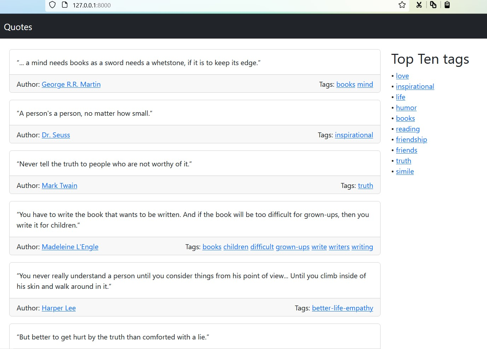
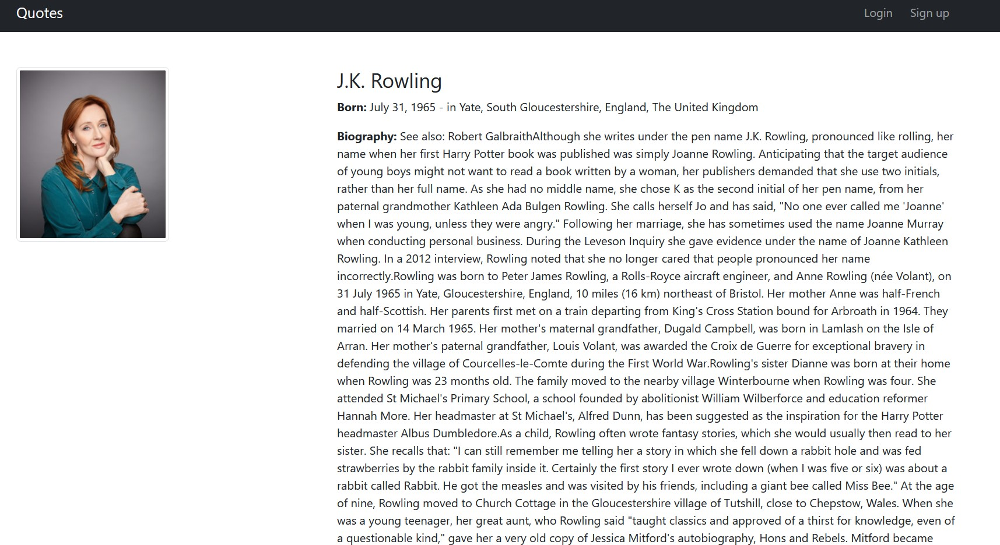
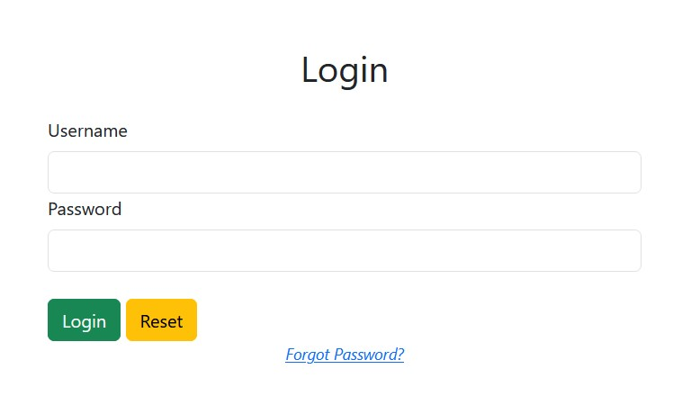
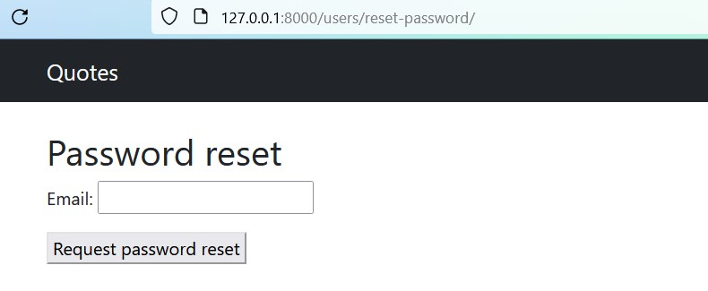
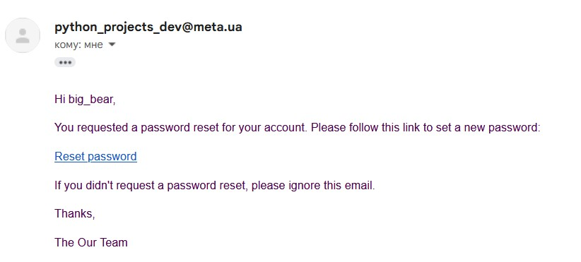
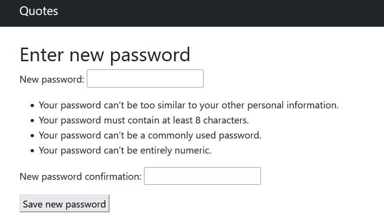

# GoIT_WEB_HW_13_part_2
Individual homework №13 at GoIT school - copy of website [**`quotes.toscrape.com`**](http://quotes.toscrape.com/).


<div>
  <a href="https://www.python.org" target="_blank">
    
  </a>
  &nbsp;&nbsp;&nbsp;&nbsp;
  <a href="https://www.djangoproject.com" target="_blank">
    
  </a>
  &nbsp;&nbsp;&nbsp;&nbsp;
  <a href="https://www.postgresql.org" target="_blank">
    
  </a>
  &nbsp;&nbsp;&nbsp;&nbsp;
  <a href="https://www.mongodb.com" target="_blank">
    
  </a>
  &nbsp;&nbsp;&nbsp;&nbsp;
  <a href="https://getbootstrap.com" target="_blank">
    
  </a>
  &nbsp;&nbsp;&nbsp;&nbsp;
  <a href="https://www.w3.org/html" target="_blank">
    
  </a>
</div>


## Description 

This work is a continuation of the GoIT_WEB_HW_10 project. This part implements the mechanism of password reset for registered users. Also all sensitive data such as passwords and keys are stored in environment variables.
Please visit this project kickoff page to keep up to date with the project's features [GoIT_WEB_HW_10](https://github.com/S-Stepanov-1/GoIT_WEB_HW_10.git)

## Running the program

• Clone this repository to your computer. To do this, run a command prompt and type
```
git clone https://github.com/S-Stepanov-1/GoIT_WEB_HW_13_part_1.git
```
• Then you need to go to the project directory and install the dependencies:
```
cd hw_10_website
poetry install
```
• The site is configured to work with a Postgres database. Therefore, you will also need access to this database. This can be done, for example, by running a **`Docker container`**: 
```
docker run --name container_name -p 5432:5432 -e POSTGRES_PASSWORD=your_secret_password_here -d postgres.
```

Instead of `container_name` and `your_secret_password_here`, you need to specify the name of the container and its password, respectively. 
After that you need to create a `config.ini` file in the project folder. This file should have the following path `hw_10_website/config.ini` In this file specify passwords for access to the database and the name of the database.

```dotenv
MONGO_USER = mongo_user
MONGO_PASS = mongo_user_password

POSTGRESQL_USER = postgres_user
POSTGRESQL_PASS = your_postgres_password
POSTGRESQL_HOST = 127.0.0.1
POSTGRESQL_PORT = postgres_port (e.g. 5432; you specified it by running Docker container)

MAIL_USERNAME = your_email_address
MAIL_PASSWORD = your_enail_password
MAIL_FROM = your_email_address
MAIL_SERVER = your_mail_server


SECRET_KEY = Django_secret_key
```


### `Note that you must run all of the following commands in the console from the hw_10_website folder`


• You can now perform the migrations. This will create tables in your PostgreSQL database:
```
python manage.py migrate
```

• If you have a MongoDB database with data, you can migrate all your data to PostgreSQL. To do this, run the following command:
```
python -m  utils.custom_migration 
```
If you don't have any data, you can simply populate your site after the server is up and running.

• Now you can start the server and access the site at 127.0.0.1:8000
```
python manage.py runserver
```

### Website



### Author's profile



## Forgot password?

If the user has forgotten the password, she/he just needs to click at "Forgot password?". 



After that it is necessary to enter her/his e-mail in the form, an e-mail will be sent to this e-mail address with a link to the page for setting a new password.




### Mail


After entering the new password, it will be resaved in the database and the user will be able to use it at the next login.


